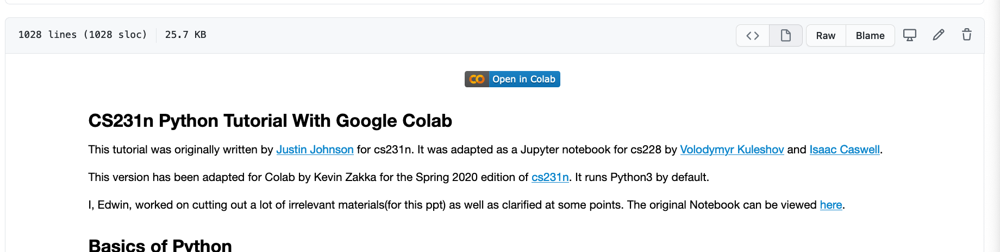

# Introduction to Coding

The main presentation slides are present in `Intro to Coding in Robotics.pdf`

You are encouraged to open the following notebooks in Google Collab and follow along.
Google Collab is a way to share runnable code that has explanation right next to the code.

The following python notebooks, when you open them in github, will give you link to `Open in Collab`
like so

* `1-Python Tutorial.ipynb`
* `2-Libraries - Matplotlib.ipynb`
* `3-OpenCV Object Detection.ipynb`
